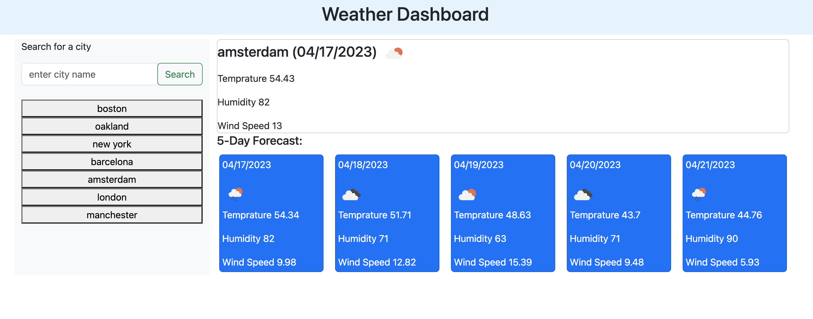

## Weather Dashboard App

User can search for a city and get the current weather and a 5-day forecast. The search history is saved in local storage and displayed as buttons for the user to click on and get the weather for that city again.

## The deployed site screenshot

## The deployed site link

https://demiapollo.github.io/weatherDashboard/
